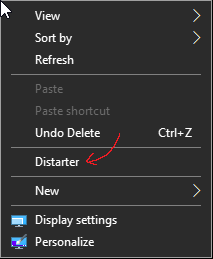

# distarter
a script to toggle the windows 10 startmenu

## changes
- replace nsudo for gsudo (assumes it is installed)
- remove submenu from context menu option
- remove icon from context menu option
- seperate toggle and desktop logic